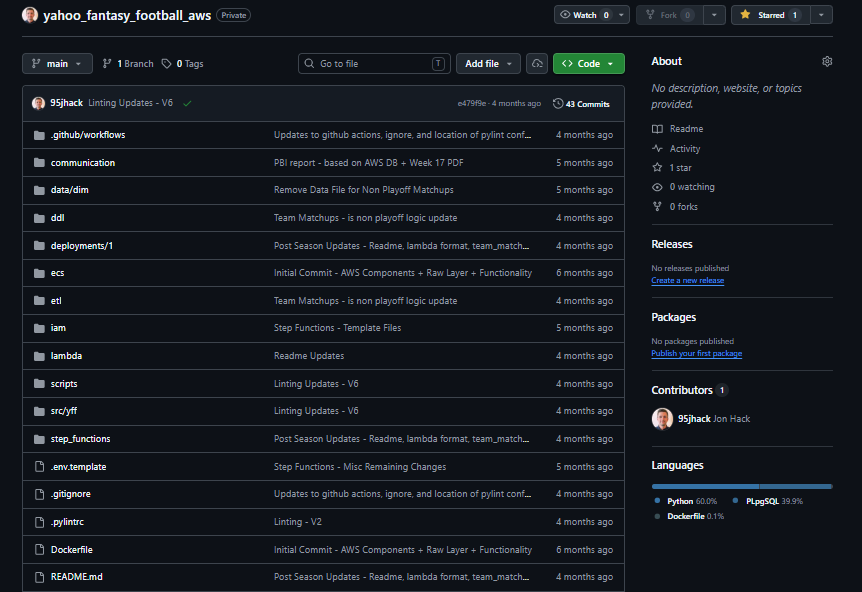
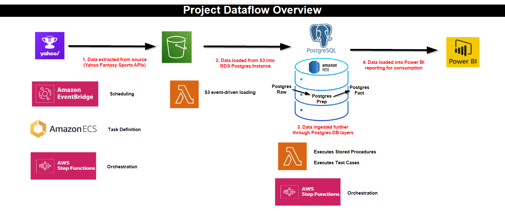

# Portfolio Project Details

**Last Updated**: May 22, 2026

This repository will provide insights into my portfolio project. My project is a comprehensive data platform for Yahoo Fantasy Football analytics using AWS services including ECS Fargate, Lambda, Step Functions, RDS PostgreSQL, and S3. Due to the amount of personal time I have invested into my project, I am keeping the actual repository private. This public repository will go into details about the design of my project to highlight the key features &amp; learnings.

## Repository Overview: 

## Project Dataflow:

## Example Output:
[text](example_2025_week_17.pdf)
* The included pdf is an example from my Fantasy Football Leagues Week 17 communication.

## Key Features

✅ **9 Data Extraction Pipelines** - ECS Fargate tasks extract data from Yahoo API  
✅ **Event-Driven Loading** - Lambda functions automatically load S3 data to RDS  
✅ **Step Functions Orchestration** - State machines manage complex workflows  
✅ **Multi-Layer Data Modeling** - Raw → Prep → Fact layer transformations  
✅ **Automated Data Quality** - Built-in validation and testing procedures  
✅ **Complete Observability** - CloudWatch monitoring, SNS alerts, execution tracking

## Design Decisions

More details will be added in the coming days.
